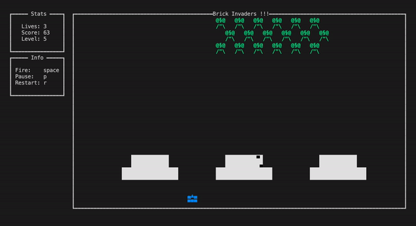
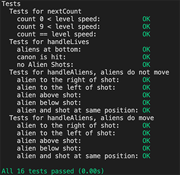

# BrickInvaders
```
  ____       _      _    _                     _               
 | __ ) _ __(_) ___| | _(_)_ ____   ____ _  __| | ___ _ __ ___ 
 |  _ \| '__| |/ __| |/ / | '_ \ \ / / _` |/ _` |/ _ \ '__/ __|
 | |_) | |  | | (__|   <| | | | \ V / (_| | (_| |  __/ |  \__ \
 |____/|_|  |_|\___|_|\_\_|_| |_|\_/ \__,_|\__,_|\___|_|  |___/
                       
```
Haskell Space Invaders with Brick. Play Space Invaders in your Terminal!



# Installation on macOS / Linux
Brickinvaders is a Haskell project. You'll need to have GHC installed.

Download the source-code and start Brickinvaders with the following cabal command:
```
$ cabal update
$ cabal run brickinvaders
```

# Installation on Windows
To Run Brickinvaders on Windows use WSL 2 (Windows Subsystem for Linux).

Inside WSL you'll need to have GHC installed.

Download the source-code and start Brickinvaders with the following cabal command:
```
$ cabal update
$ cabal run brickinvaders
```
# Game
Kill all aliens before they reach the ground or before they kill you. Each alien-kill gives you one point, if you destroy the spaceship you get ten points.

# Controls
- `space`  Shoot
- `Arrow Keys` Move
- `p` Pause Game
- `r` Restart Game

# Features
- Moving aliens that also shoot
- Moving spaceship
- Tank controlled by the player
- Blockers which get dameged when shot
- Pause and restart the game
- Player has multiple lives
- Scoring system
- Level system with following options
    - amount of aliens
    - alien speed
    - alien shoot speed
    - spaceship speed
    - amount of shots it takes to kill an alien


# Testing
The test are located in the `test` Folder.

To run the Tests use:
```
$ cabal run brickinvaders-test
```
